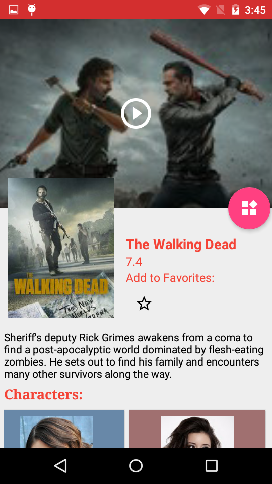
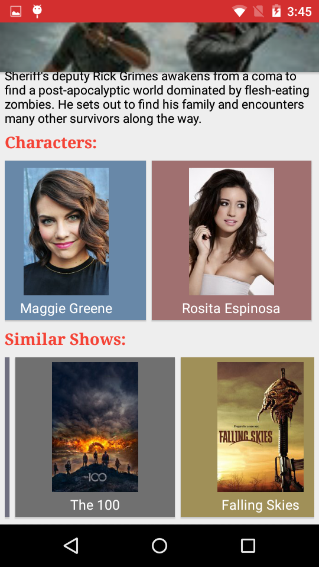

# Telelove
Capstone project for Udacity Android Nanodegree.
Features:  
<UL>
<LI>All the detailed information about a TV series from their overview, release, ratings. </LI>
<LI>It also has features for viewing trailers of the TV series</LI>
<LI>Giving periodic notifications containg quotes from different TV series.</LI>
<LI>Having options for viewing similar shows to the viewed TV series</LI>
<LI>Having options to view full cast</LI>
</UL>
Libraries used:
<UL>
<LI>Retrofit</LI>
<LI>RxJava</LI>
<LI>GSON</LI>
<LI>FirebaseJobDispatcher</LI>
<LI>Firebase RealtimeDatabase</LI>
<LI>Picasso</LI>
<LI>Dagger2</LI>
<LI>ButterKnife</LI>
<LI>Material Favorite Button</LI>
<LI>Support Libraries</LI>
</UL>
 
Screenshots:
  
 &nbsp; &nbsp;&nbsp;  &nbsp; &nbsp;&nbsp;   &nbsp; &nbsp;&nbsp;  &nbsp; &nbsp;&nbsp;

